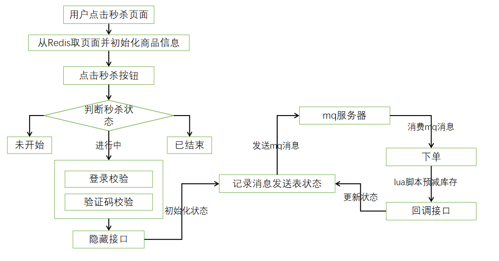
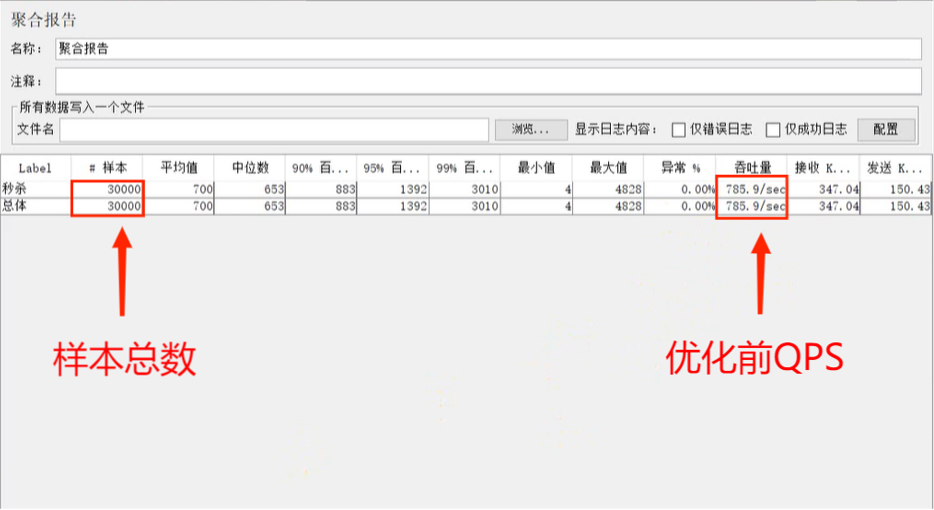
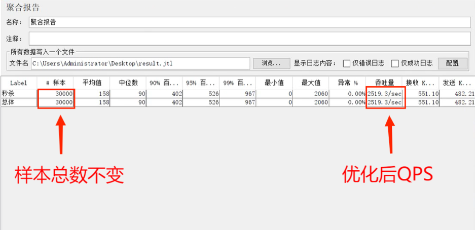

# 基于Redis+RabbitMQ的秒杀系统的设计与实现

该项目设计采用了SpringBoot、Redis、MQ异步处理、MyBatis、MySQL等技术。

### 技术构成：

1、以SpringBoot+Redis+MQ为框架减轻数据库和客户端的大流量访问负担，同时具有维护和扩展方便的优点。
2、以Java为主要的语言开发，利用MyBatis和MySQL实现快速便捷的交互数据。
3、以页面静态化和AccessLimit拦截器限流的方式实现对高并发的控制。
4、以验证码和隐藏接口的方式提高了系统的安全性。

### 目的：

本课题所设计的秒杀系统不仅实现了基本的定时秒杀功能，还提高了对秒杀页面访问的速度以及对安全性的优化，帮助电商平台更好的做好秒杀活动。

## 项目核心框架

## 系统进行优化前

## 优化后效果

## 总结

由于是第一次开发这样的系统再加上对相应的技术不是非常熟练，所以在设计和开发过程中，也遇到了很多困难。
比如说对MQ消息队列的使用只能学习别人的固有模式，并不能很好的选择合适的交换机类型应对不同秒杀场景，这也是本系统在今后需要改进和优化的地方。但是我相信只要坚持下去，都会有一番丰厚的收获。